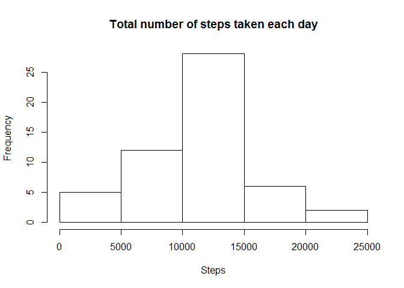
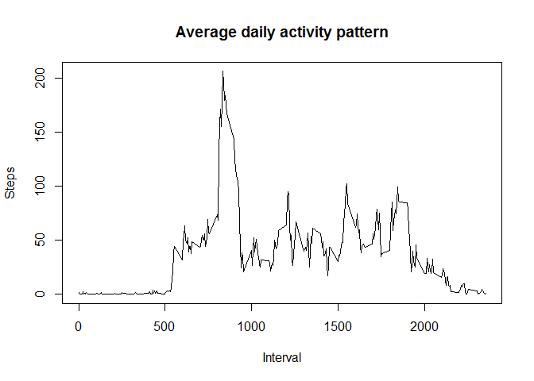
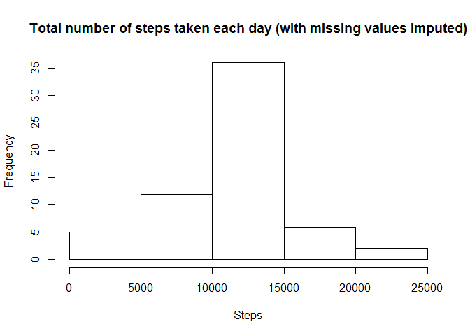
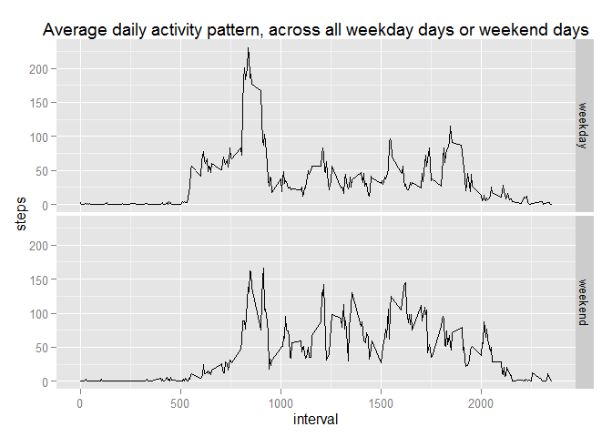

# Reproducible Research: Peer Assessment 1


## Loading and preprocessing the data

```r
unzip("activity.zip")
data <- read.csv("activity.csv")
```

## What is mean total number of steps taken per day?

```r
total <- aggregate(steps ~ date, data, sum)
hist(total$steps, main="Total number of steps taken each day", xlab="Steps")
```

 

Mean of total number of steps taken each day:

```r
mean(total$steps)
```

```
## [1] 10766.19
```

Median of total number of steps taken each day:

```r
median(total$steps)
```

```
## [1] 10765
```

## What is the average daily activity pattern?

```r
avg <- aggregate(steps ~ interval, data, mean)
plot(avg$interval, avg$steps, type="l", main="Average daily activity pattern", xlab="Interval", ylab="Steps")
```

 

The 5-minute interval which contains the maximum number of steps:

```r
avg[which.max(avg$steps),]
```

```
##     interval    steps
## 104      835 206.1698
```

## Imputing missing values
Total number of rows with missing values na:

```r
sum(is.na(data$steps))
```

```
## [1] 2304
```
A new data set will be created where all the na values will be replaced with mean for that 5-minute interval

```r
new_data <- data # make a copy of the data
nas <- is.na(new_data$steps) # find all rows with na
avg <- tapply(new_data$steps, new_data$interval, mean, na.rm=TRUE, simplify=TRUE) # calculate the avg of interval
new_data$steps[nas] <- avg[as.character(new_data$interval[nas])] # assign the avg value to the missing value
```

```r
new_total <- aggregate(steps ~ date, new_data, sum)
hist(new_total$steps, main="Total number of steps taken each day (with missing values imputed)", xlab="Steps")
```

 

Mean of total number of steps taken each day  (with missing values imputed):

```r
mean(new_total$steps)
```

```
## [1] 10766.19
```

Median of total number of steps taken each day  (with missing values imputed):

```r
median(new_total$steps)
```

```
## [1] 10766.19
```
Mean is the same for both data set (with / without imputed missing values), however there is slight difference for the median.

## Are there differences in activity patterns between weekdays and weekends?

```r
new_data$daytype <- ifelse(weekdays(as.Date(new_data$date)) %in% c("Saturday", "Sunday"), "weekend", "weekday")
new_data$daytype <- as.factor(new_data$daytype)
```

```r
avg <- aggregate(steps ~ interval + daytype, new_data, mean)
library(ggplot2)
```

```
## Warning: package 'ggplot2' was built under R version 3.2.1
```

```r
ggplot(avg, aes(x=interval, y=steps)) +
  facet_grid(daytype ~ .) +
  ggtitle("Average daily activity pattern, across all weekday days or weekend days") +
  geom_line()
```

 
